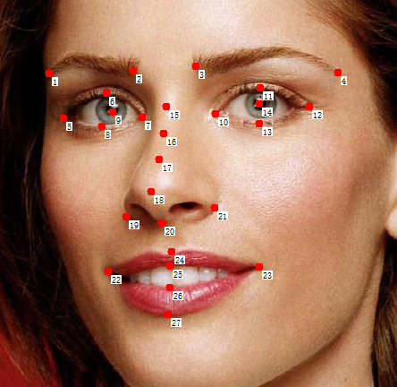
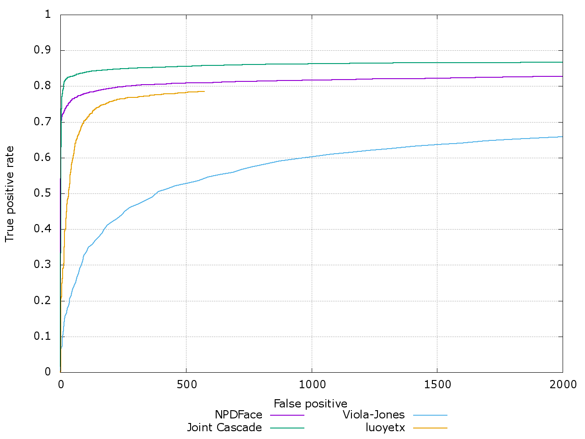

Model
=====

A model I have trained. Basic config is shown below.

```
T = 5
K = 540
landmark = 27
multi_scale = false
```

The model contains 5 stages and 540 carts in every stage. It uses 27 facial landmark points and doesn't use multi scale to extract the feature. This [config.json](config.json) is used to train this model.

### landmarks



### FDDB Test



This model is labeled `luoyetx`. I set a score threshold to remove most false positive result.

### Performace

It depends on your optimization and parameter settings.

### Video Test

I have tested this model on a very simple video, see [here](https://youtu.be/AuGOAXbS-yI).
